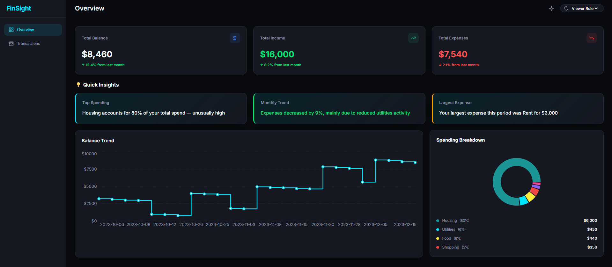

## Financial-Dashboard UI---FinSight 

🚀 **Live Demo:** [LINK](https://financial-dashboard-ui-fin-sight.vercel.app/)

A comprehensive, responsive financial dashboard built with React and Vite. It provides users with powerful tools for tracking financial activity, managing transactions intuitively, and gaining intelligent insights through interactive data visualizations.

## Key Features

- **Dynamic Natural Language Insights**: Contextual, smart insights that compare month-over-month expenses and automatically diagnose main categories causing spending changes.
- **Dashboard Overview**: Track key financial metrics and view trends via high-level summary cards.
- **Data Visualization**: Interactive and responsive charts (built with Recharts) to analyze spending patterns and categorical breakdowns.
- **Transaction Management**: 
  - Add and delete transactions.
  - Search, filter (by type/category), and sort items easily.
  - View data in a paginated table supporting custom page sizes.
- **Export Data**: Download your filtered transactions directly as CSV or JSON files.
- **Simulated Roles**: Switch between *Admin* (full access) and *Viewer* (read-only) roles seamlessly.
- **Dark & Light Themes**: State-of-the-art UI supporting dynamic theme switching.

## Overview

<div align="center">
         
</div>


## Transaction - Admin Role

<div align="center">
         
</div>

## Transaction - Viewer Role

<div align="center">
         
</div>


## Tech Stack

- **Framework**: React 18
- **Build Tool**: Vite
- **Styling**: Vanilla CSS with modern dynamic variables
- **Charts**: Recharts
- **Icons**: Lucide React
- **Date Utility**: date-fns

## Getting Started

### Prerequisites

Ensure you have Node.js installed.

### Installation

1. Clone the repository or extract the project files to your desired directory.
2. Open a terminal and navigate to the project directory:
   ```bash
   cd "Financial Dashboard UI - FinSight"
   ```
3. Install the required dependencies:
   ```bash
   npm install
   ```
4. Start the local development server:
   ```bash
   npm run dev
   ```
5. Open your browser and navigate to `http://localhost:5173/`.


## Usage & Navigation

- Navigate to the **Dashboard** for an overview of income vs. expenses along with insightful data charts.
- Use the **Transactions** tab to review, sort, and manage all your individual financial entries. 
- You can switch between active user roles or toggle your preferred theme setting utilizing the controls in the top navigation bar.

## Customization

You can selectively adjust primary UI aesthetics (such as light/dark palettes, fonts, and dimensions) by modifying the root variables available inside `src/index.css`.

## License

This project is licensed under the MIT License - see the [LICENSE](LICENSE) file for details.


Made with ❤️ by Abhishek Bajpai
